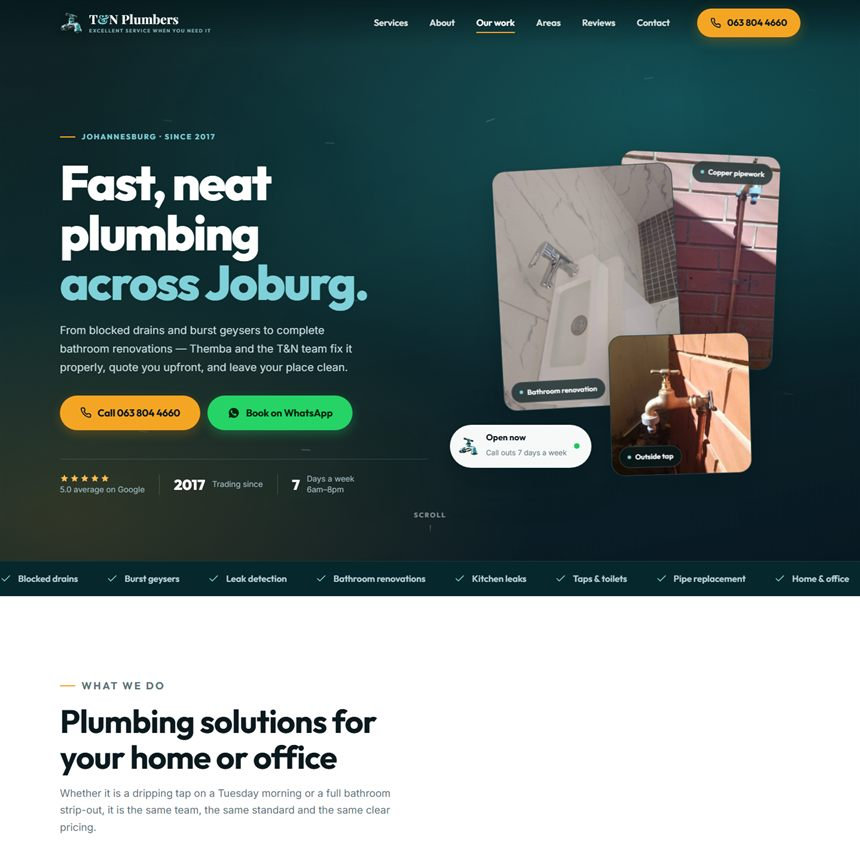
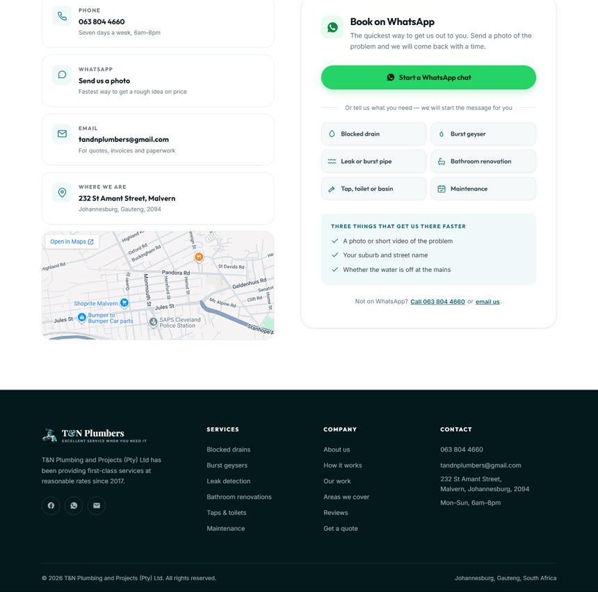

# T&N Plumbers — tnplumbers.co.za

A single-page website for **T&N Plumbing and Projects (Pty) Ltd**, Johannesburg.
Plain HTML, CSS and JavaScript. No build step, no framework, no dependencies —
upload the folder to any host and it works.



Every enquiry button opens a WhatsApp chat with the message already typed.
There is no contact form and no server to run.



---

## Files

```
index.html            the whole site
robots.txt            tells Google it may index the site
sitemap.xml           lists the page for search engines
.htaccess             caching + gzip (Apache / cPanel hosts; harmless elsewhere)

assets/
  css/site.css        all styling and the design tokens
  js/site.js          nav, tabs, services swap, before/after slider, WhatsApp links
  img/                web-ready images used by the site
  photos/             ORIGINAL downloads from Facebook (source files, not used
                      by the page — keep them, they are the master copies)

medi/                 your original logo + the screenshots you supplied
```

---

## Publishing it

Upload **everything except `medi/` and `assets/photos/`** to your web host's
public folder (usually `public_html` or `www`). Those two folders are working
files — they do no harm if uploaded, they just are not needed.

Nothing needs to be compiled or installed. `index.html` must sit at the top
level so the site loads at `tnplumbers.co.za`.

### Previewing it on this computer

```bash
npx --yes http-server "C:\Users\rolan\OneDrive\Documents\T&N Plumbers" -p 5507 -c-1
```

Then open <http://localhost:5507>.

---

## Changing things

### Phone number
It appears in several places. Find and replace both forms:
- `063 804 4660` — the number people read
- `+27638044660` — the `tel:` links
- `27638044660` — the WhatsApp links

### How enquiries reach you
There is **no contact form**. Every enquiry button opens a WhatsApp chat with
you, with the first message already typed in. Nothing to check, no inbox to
watch, no server needed — it lands in WhatsApp like any other customer message.

There are 16 of these links. The main ones:

| Where | Opening message |
|---|---|
| Hero "Book on WhatsApp" | *I would like to book an appointment.* |
| Services panel button | *I would like to book: \<service name\>* |
| About "Message Themba" | *Hi Themba. I would like to book an appointment.* |
| Contact panel, 6 quick picks | one per problem — blocked drain, burst geyser, leak, bathroom, taps, maintenance |

To change the wording, edit the `?text=` part of the link in `index.html`.
Spaces are written as `%20` and `&` as `%26` — keep that or the link breaks.
The services buttons are built in `assets/js/site.js` (the `waLink` function),
where you can type the message normally.

Phone and email are still on the page for anyone who prefers them.

### Services
The six service names live in `index.html` (the `svc__list`), and their
descriptions live in `assets/js/site.js` in the `SERVICES` array. Keep the two
lists in the same order — item 1 in the list uses description 1.

### Suburbs you cover
In `index.html`, the `chips` list in the **Areas** section. Add or remove
`<li>` items. `class="is-hub"` makes one highlighted in teal.

### Reviews
In `index.html`, the `rev__rail` section. Copy an `<article class="rcard">`
block and change the quote, name and meta line. These are your real Google
reviews, quoted word for word — worth keeping them that way.

### Before / after photos
In `index.html`, look for the comment block `BEFORE / AFTER SLIDER`.
To add a pair: copy the whole `<div class="ba__item">` block, point the two
`` at your matched photos, update the heading and description, and
give the `<input>` a new unique id (`cmp2`, `cmp3`…). The slider wires itself
up — no JavaScript changes needed.

### Colours
Everything is driven by CSS variables at the top of `assets/css/site.css`.
Change `--teal-600` and the whole site follows. The current teal (`#16808A`)
was sampled directly from the tap in your logo.

---

## Adding photos

Drop new job photos into `assets/img/` and reference them in `index.html`.
Before you do:

1. **Crop off the camera watermark** (the "HUAWEI nova 8i" line). The existing
   images already had the bottom 10% trimmed for this reason.
2. **Resize to about 900px wide** — full-size phone photos are several
   megabytes and will make the site slow on mobile data.

---

## What was used to build this

- **Logo** — your `medi/logo.png`, background removed and split into a
  transparent tap mark (`assets/img/mark.png`) plus the full lockup
  (`assets/img/logo-full.png`). The wordmark on the site is live text in
  Playfair Display so it stays sharp at any size.
- **Photos** — the five job photos from your Facebook page.
- **Reviews** — your real Google reviews, quoted exactly.
- **Details** — 232 St Amant Street, Malvern; 063 804 4660;
  tandnplumbers@gmail.com; trading since 2017; open 06:00–20:00 seven days.

Fonts are Outfit (headings), Inter (body) and Playfair Display (the wordmark),
loaded from Google Fonts.

---

## Accessibility and SEO

- Passes WCAG AA colour contrast throughout (checked pair by pair).
- Full keyboard support; visible focus rings; skip link.
- Respects "reduce motion" — every animation stops, nothing breaks.
- `Plumber` structured data (schema.org) with your address, hours, phone and
  service list, so Google can show you properly in local results.
- Open Graph tags so the link previews correctly on WhatsApp and Facebook.

---

## Still to do

- Confirm the before/after pair is genuinely one job, or send real pairs.
- Send more photos — five is thin for a business with this many good reviews.
- Confirm the suburb list matches where you actually travel.
